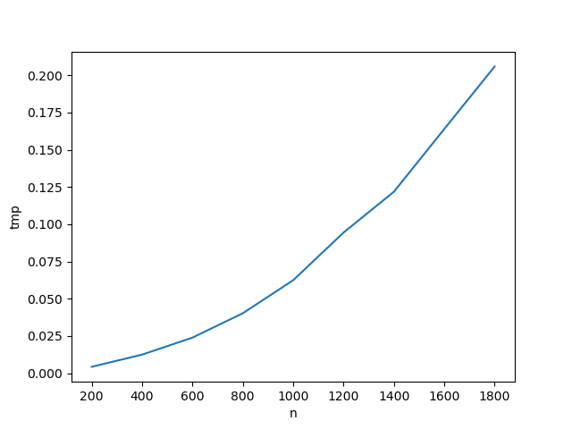

# Evolution du temps de calcul

### Question 6

 

 

### Question 7

On observe que le temps de calcul est exponentiel ce qui correspond bien à la complexité théorique démontrée en TD.

 

### Question 8

 

 

Le nombre d'itérations en moyenne est environ n (n étant le nombre d'étudiants). Pourtant la complexité théorique est de O(n²), ce qui montre que l'algorithme est très efficace.